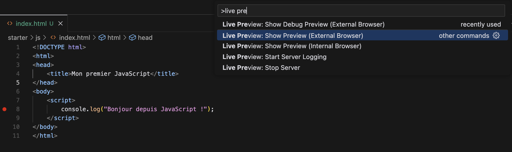
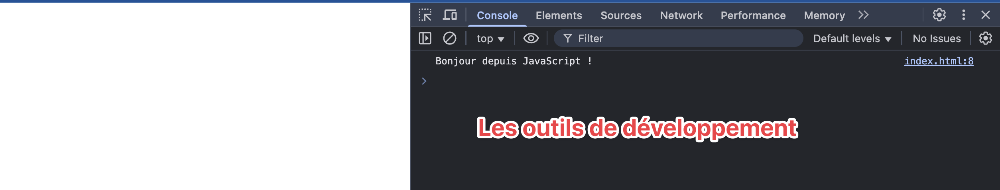
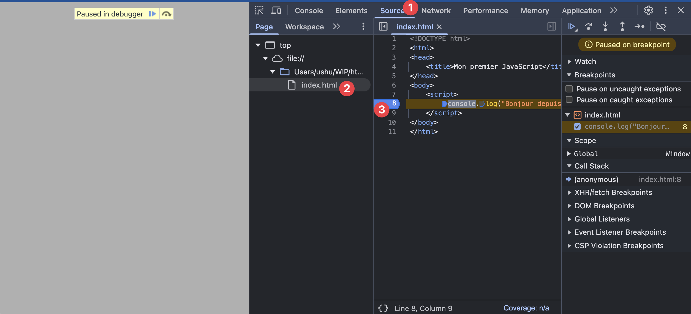
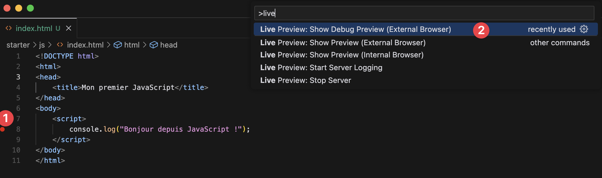
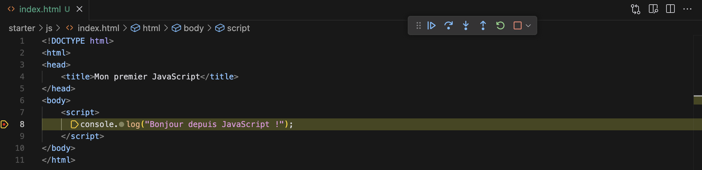

import Rendu from "../../../components/rendu.astro";

# JavaScript : Les bases

## 1. Un peu d'histoire

JavaScript a été créé en 1995 par Brendan Eich alors qu'il travaillait chez Netscape Communications. À l'origine, il devait s'appeler LiveScript, mais a été renommé JavaScript pour surfer sur la popularité du langage Java à l'époque.

Le langage a été développé en seulement 10 jours pour répondre à un besoin crucial : ajouter de l'interactivité aux pages web. À cette époque, les pages HTML étaient statiques et il fallait recharger la page pour chaque interaction.

Quelques dates clés :

- 1995 : Création de JavaScript
- 1996 : Standardisation par ECMA International (d'où le nom ECMAScript)
- 2009 : Node.js est créé, permettant d'exécuter JavaScript côté serveur
- 2015 : ECMAScript 6 (ES6) apporte des améliorations majeures au langage

## 2. Premiers pas avec JavaScript

### Dans le navigateur

Pour exécuter du JavaScript dans une page web, vous pouvez utiliser la balise `<script>` :

```html
<!DOCTYPE html>
<html>
  <head>
    <title>Mon premier JavaScript</title>
  </head>
  <body>
    <script>
      console.log("Bonjour depuis JavaScript !");
    </script>
  </body>
</html>
```

Afin de visualiser le résultat, il faut enregistrer le fichier et l'ouvrir avec le navigateur Chrome que nous avons installé en cours de route.

Plusieurs possibilités s'offrent à vous :

1. Ouvrir le fichier index.html dans le navigateur via le menu contextuel (Fichier > Ouvrir le fichier)
2. Utiliser la fonctionnalité "Show Preview (External Browser)" de Visual Studio Code, qui permet d'ouvrir le fichier dans le navigateur "par défaut". \
   Cette option provient de l'extension "Live Preview" que nous avons installée en cours.
   

Une fois le fichier ouvert, il vous sera possible d'afficher la console du navigateur en appuyant sur `Ctrl+Shift+I` (ou `Cmd+Option+I` sur Mac) afin d'ouvrir les outils de développement.


**BONUS**: il est également possible de "déboguer" l'exécution du code en plaçant des points d'arrêt dans le code et en lançant le débogage dans la console.
Encore une fois, deux options s'offrent à vous :

1. Utiliser directement les outils de Chrome: choisir l'onglet "Sources" et placer un point d'arrêt en cliquant sur la ligne de code de votre choix.
   Puis rechargez la page et le point d'arrêt sera atteint:
   
2. Utiliser directement l'extension "Live Preview" de Visual Studio Code, que nous avons installée en cours: placez votre breakpoint puis utiliser la commande "Show Debug Preview (External Browser)"
   
   vous pourrez alors voir le débogage se lancer dans le navigateur:
   

### Avec Node.js

Vous pouvez aussi exécuter JavaScript en dehors du navigateur avec Node.js. Créez un fichier `script.js` :

```javascript
console.log("Bonjour depuis Node.js !");
```

Puis exécutez-le dans le terminal :

```bash
node script.js
```

**BONUS**: il est également possible de lancer le script directement depuis VSCode en lançant le débogage avec Node.js.
pour cela, il suffit de placer un point d'arrêt dans le code et de lancer le débogage avec le bouton "Déboguer" (F5) dans VSCode, avec le fichier ouvert dans l'éditeur.

## 3. Les bases de la syntaxe

### Les variables

En JavaScript moderne, nous utilisons `let` et `const` pour déclarer des variables :

```javascript
// let pour les variables qui peuvent changer
let age = 25;
age = 26; // OK

// const pour les constantes
const nom = "Alice";
// nom = "Bob"; // Erreur !
```

### Les types de données

JavaScript possède plusieurs types de base :

```javascript
// Nombres
let nombre = 42;
let decimal = 3.14;
// ATTENTION : En JavaScript, tous les nombres sont stockés en tant que nombres à virgule flottante double précision (64 bits)
// Il n'y a pas de distinction entre entiers et décimaux comme dans d'autres langages !

// Chaînes de caractères
let texte = "Bonjour";
let texte2 = "Monde";

// comme pour python avec les "format strings", il est possible d'utiliser des variables dans les chaînes de caractères via une syntaxe similaire
let texte3 = `Bonjour ${texte} et ${texte2} !`;

// Booléens
let estVrai = true; // attention, true et false sont des mots réservés en JavaScript et ne prennent pas de majuscules !
let estFaux = false;

// Tableaux
let fruits = ["pomme", "banane", "orange"];

// Objets
let personne = {
  nom: "Alice",
  age: 25,
};

// Undefined et null
let nonDefini;
let vide = null;
```

## 4. Les fonctions

Voici un exemple simple de fonction qui calcule l'aire d'un rectangle :

```javascript
function calculerAire(longueur, largeur) {
  return longueur * largeur;
}

// Utilisation de la fonction
let aire = calculerAire(5, 3);
console.log("L'aire est de : " + aire); // Affiche 15
```

On remarquera les éléments de cette syntaxe:

- `function` : mot réservé pour définir une fonction
- `calculerAire` : nom de la fonction
- `(longueur, largeur)` : les paramètres de la fonction
- `return` : mot réservé pour renvoyer une valeur (comme en Python !)
- `let aire = calculerAire(5, 3);` : appel de la fonction avec les arguments 5 et 3

**BONUS**: il est également possible de définir des fonctions en une seule ligne, comme en Python avec `lambda`:

```javascript
let aire = (longueur, largeur) => longueur * largeur;
```

Cette syntaxe est très pratique pour les fonctions simples qui ne nécessitent qu'une seule instruction.
Les éléments de cette syntaxe sont:

- `(longueur, largeur)` : les paramètres de la fonction
- `=>` : mot réservé pour définir une fonction en une seule ligne
- `longueur * largeur` : l'instruction à exécuter

Il est même possible de mélanger les deux syntaxes, en utilisant la syntaxe `=>` et en l'associant à un bloc d'instructions encadré par des accolades `{}` par exemple:

```javascript
let aire = (longueur, largeur) => {
  return longueur * largeur;
};
```

## 5. Les structures de contrôle

### Conditions (if)

```javascript
let age = 18;

if (age >= 18) {
  console.log("Vous êtes majeur");
} else {
  console.log("Vous êtes mineur");
}
```

### Boucles

La boucle for :

```javascript
for (let i = 0; i < 5; i++) {
  console.log("Tour numéro " + i);
}
```

La boucle while :

```javascript
let compteur = 0;
while (compteur < 3) {
  console.log("Compteur : " + compteur);
  compteur++;
}
```

## Exercices pratiques

1. Créez une fonction qui convertit des euros en dollars (taux de change : 1€ = 1.09$)
2. Écrivez un programme qui affiche les nombres pairs de 0 à 10
3. Créez un objet représentant un livre avec ses propriétés (titre, auteur, année) et affichez-les

**ATTENTION**: Pour afficher le résultat de vos exercices, il est possible d'utiliser la fonction `console.log()` comme nous l'avons fait dans notre premier exemple.
